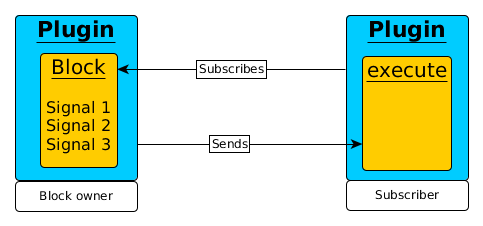
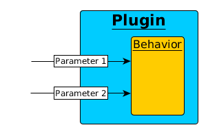

Introduction
============

PaPI stands for Plugin based Process Interaction.

The idea of PaPI was to create a program which can visualize data from
external processes by using a plugin based architecture. The main
development reason for PaPI was to replace QRtaiLab.

PaPI's architecture should try to utilize the power of multi-processor
systems by using more than just one core. While the choice of using
Python as programming language leads to a slightly slower execution
speed, it allows a fast and easy development of new plugins.

Architecture
-------------

We divided PaPI in three main parts:
    - PaPI Core
    - PaPI GUI
    - Plugin

.. figure:: _static/introduction/PaPIStructureWithArrows.png
   :alt: 

Due to the fact that the PaPI Core was realized in python, simple
multi-threading is not improving the performance (see python global
interpreter lock). That is why PaPI is using a message based
communication over multiple processes to increase performance.

Please note that process boundaries result in separated memory of the
parts.

The PaPI Core will create and manage a database with all open plugins
and the data routes.

New plugins that generate data will send them to the PaPI Core. The core
will do a look up in the routing table and redirect the message if there
is a subscriber. For processes to get messages, they need to subscribe
signals of PaPI plugins.

PaPI Plugins
============

Types
-----

PaPI divided the plugin structure in 4 types of plugins:

    - IO Plugin(IOP): Input-Output Plugins, runs in separate process, generates new data for PaPI, e.g. UDP Receiver, ORTD
    - DP Plugin(DPP): Data Processing Plugins, runs in separate process, process data in PaPI, get data from PapI, generate new data for PaPI, e.g. adding signals
    - VI Plugin(VIP): Visual Plugin, runs in GUI process, used to display data, e.g. Plot, or to provide control elements for setting parameter,  e.g. Slider.

Signal/Blocks
-------------

A PaPI Plugin can offer several signals to PaPI for other plugins to
use. Each signal is owned by a signal block. A block in PaPI is a
collection of signals that will be always synchronized. One could say
that all signals of one block have the same sample time for PaPI and are
send united. That means that signals of one block are always synchronous
in their samples but two different blocks cannot be easily related to
each other in respect to their samples.

One Plugin can offer multiple blocks and every block can offer an
arbitrary number of signals.

   **A single block contains one or more signals.**

Parameters
----------

Additionally to blocks and signals, plugins can offer parameters to PaPI which can be used to affect the internal behavior of a plugin.
A parameter can be changed using the overview menu or events, see next section.

   **Parameters can change a plugin's behavior at runtime.**

Events
------

A plugin can provide events which can be used to change parameters of other plugins.

E.g. a plugin provides a event as a ``Click`` or ``Change`` which can be subscribed by an arbitrary parameter of a different plugin. When the ``Click``-event gets triggered the parameter will be changed according to the value delivered by the event. It is also possible to provide more than one event per plugin and a single event can be subscribed by more than one parameter.

.. figure:: _static/introduction/PaPIEvent.png
   :alt:

   **Parameters can be changed by using events if a parameter subscribed an event.**

Plugin Architecture
-------------------

PaPI uses a flag based plugin interaction. That means that plugins that
want to be integrated in PaPI need to implement a list of callback
functions.

The PaPI framework provides two kind of functions for the development of plugin which can or must be implemented.

| ``callback functions``: These functions are called by the PaPI framework to interact with plugin.
| ``plugin function``: These function are called by the plugin developer to communicate with the PaPI framework.

These functions defines the core functionality of a plugin. To see more detailed information on how to create a plugin, refer to: :ref:`Design guide plugin <man_design_guide>`

There are some ``callback functions`` that must be implemented and some functions that are optional.

Functions
~~~~~~~~~

Callback functions
++++++++++++++++++

These functions can be used by all types of plugins in which the highlighted functions must be implemented.

.. code-block:: python
    :emphasize-lines: 1-4

    self.cb_initialize_plugin()
    self.cb_execute(Data, block_name, plugin_uname)
    self.cb_quit()
    self.cb_get_plugin_configuration()
    self.cb_pause()
    self.cb_resume()
    self.cb_set_parameter(self, parameter_name, parameter_value)
    self.cb_plugin_meta_updated()

These functions can only be used by plugins of type ViP.

.. code-block:: python

    self.cb_new_parameter_info(dparameter_object)

Plugin functions
++++++++++++++++

These functions can be used by all types of plugins:

.. code-block:: python

    self.pl_emit_event(data, event)
    self.pl_send_new_data(self, block_name, time_line, data)
    self.pl_send_new_event_list(events)
    self.pl_send_new_block_list(blocks)
    self.pl_send_new_parameter_list(parameters)
    self.pl_send_delete_block(block)
    self.pl_send_delete_parameter(parameter)
    self.pl_get_dplugin_info()

These functions can only be used by plugins of type ViP.

.. code-block:: python

    self.pl_create_control_context_menu()
    self.pl_get_widget()
    self.pl_set_widget_for_internal_usage()
    self.pl_get_current_config()

These functions can only be used by plugins of type IOP or DPP.

.. code-block:: python

    self.pl_set_event_trigger_mode(true|false)
    self.pl_get_current_config()

Plugin init
~~~~~~~~~~~

When creating a plugin the function ``cb_initialize_plugin`` will be
called. These functions can be used to do all basic initialization
needed for the plugin to run, e.g. open widgets or open network
connections. It is mandatory that this function returns true at the end
otherwise the plugin will not be started! One important part of the init
method is to define the signals this plugin will offer to PaPI.

For simple cases this function should be used to create blocks with signals, parameters and events. For more advanced application it is also possible to create blocks, signals, parameters and events at run-time that means after the initiate function were called.

The figure below shows the chain of called function by the PaPI framework if a plugin should be initialized.

.. figure:: _static/introduction/PaPIInitializePlugin.png
   :alt:

   **Functions called to initialize a plugin.**

plugin execution
~~~~~~~~~~~~~~~~

When a plugin is started the normal operation loop will call the ``execute``
function of a block. That means all the execution logic of a plugin
needs to be integrated in the execute function. It is important to note
that the execute function must be **non-blocking**. When a blocking
functionality is needed one can achieve that by using a thread. In this
function new data can be sent to PaPI using a PaPI function.

The ``execute`` function is when a new data package arrives.

plugin quit
~~~~~~~~~~~

When a plugins is deleted, stopped or PaPI will end operation, the
``quit()`` function will be called to enable the plugin developer to
clean things up, e.g. to close network connections or file handles.

Additional functions
~~~~~~~~~~~~~~~~~~~~

For additional functions and deeper understanding or programming
examples, please take a look at :ref:`Design guide plugin <man_design_guide>`

Graphical User Interface
------------------------

Main Window
~~~~~~~~~~~

The main window of PaPI will look like this:

   **PaPI main window**

The main window of PaPI contains the following elements.

1. Toolbar : Contains all actions sorted by different topics.
2. Common actions were displayed here:
    - Load configuration
    - Save configuration
    - Open: Create Plugin Menu
    - Open: Show Plugin Menu
    - Reset PaPI
3. Favourite plugins were displayed here.
4. Area which contains all started visual plugins.

PaPI menu
~~~~~~~~~

   **Toolbar: PaPI**

The `PaPI menu` contains the following actions:

1. Load: Load a new configuration
2. Save: Save the current configuration.
3. ReloadConfig: Reset PaPI and reload the last loaded configuration.
4. ResetPaPI: Remove all plugins and subscriptions.
5. Exit: Quit PaPI

Plugin menu
~~~~~~~~~~~

.. figure:: _static/introduction/GUI_Toolbar_Plugin.png
   :alt:

   **Toolbar: Plugin**

The `Plugin menu` contains the following actions:

1. Overview: Opens a menu which
    - displays all known information about all running plugins.
    - is used to create subscriptions.
2. Create: Opens a menu which is used to create new plugins.
3. Reload DB: Reloads the internal database containing information about all available plugins.

View menu
~~~~~~~~~

.. figure:: _static/introduction/GUI_Toolbar_View.png
   :alt:

   **Toolbar: View**

1. RunMode: Enables a less customizable view.
    - STILL IN DEVELOPMENT
2. Toolbar: Hide and show the toolbar

Help menu
~~~~~~~~~

   **Toolbar: Help**

1. PaPI Wiki: Opens the wiki hosted on Github in the default web browser.
2. PaPI Doc: Opens the offical documentation for the current PaPI version in the default web browser.
3. About: Displays information about the current PaPI version.
4. About Qt: Displays information about the current Qt version.