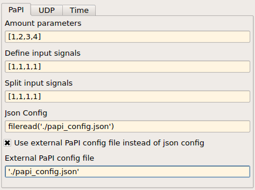

Matlab
======

Dependencies
------------
The PaPI-matlab interface needs the following libraries:

.. list-table:: Libraries
    :widths: 15 30
    :header-rows: 1

    * - Library
      - Description
    * - libjson
      - Better handling of json in cpp
    * - libboost
      - Basic boost library
    * - libboost-thread
      - Boost thread support
    * - libboost-signals
      - Boost signal support

The depencies can be easily fulfilled by installing the following packages:

.. code:: bash

    sudo apt-get install libjsoncpp-dev libboost1.55-dev libboost-thread1.55-dev libboost-signals1.55-dev

Library
-------

The library is made out of two blocks.

The `PaPI Block` is the core block which calls the underlying S_Function to provide a communicaion with PaPI. This block `SHOULD NOT` be used.

.. figure:: _static/matlab/PaPI_Block.png
   :alt: 

The `PaPI Block Complete` made of sub system which contains the `PaPI Block`. This blocks contains an easy configurable interface to the core block. This block `SHOULD` be used.

.. figure:: _static/matlab/PaPI_Block_Complete.png
   :alt: 

Build
-------

All needed functions are compiled and added to the Matlab search path when the build was executed.
The build script can be found in `</path/to/papi>/PaPI/matlab/`

After execution the new library `PaPI` will appear in the simulink library.

Code generation 
---------------

By using the ert_linux it is also possible to build (code generation) a simulink model but it is needed to modify some model settings.

The settings for `Code Generation/Custom Code` must be edited as following:

.. code-block:: matlab

    Include directories:

    /usr/local/MATLAB/R2014b/sys/os/glnxa64/
    /usr/lib/x86_64-linux-gnu/
    /usr/include/

.. code-block:: matlab

    Libraries:

    libstdc++.so.6
    libgcc_s.so.1 
    libgfortran.so.3
    libdl.so
    libboost_system.so
    libboost_thread.so
    libboost_signals.so

Block Configuration
-------------------
Tab 1
^^^^^

   **This tab is used to describe the signals and parameters as they appear in PaPI.**

Parameters
^^^^^^^^^^
The parameters are described by an array. 

The array [1,2,3,4] leads to 4 different parameters, the parameter dimension is defined by the corresponding array index. 
Therefore, the first parameter has a size of 1, the second a size of 2, the third a size of 3 and the fourth a size of 4.

Is is also possible to name the parameters by giving the signal in simulink a name.

.. figure:: _static/matlab/Parameter_Example_1.png
   :figwidth: 40%
   :alt:

   **Signals of the parameters were named in simulink.**

   **As the parameters will appear in PaPI.**

Signals
^^^^^^^

Naming
^^^^^^

Tab 2
^^^^^
.. figure:: _static/matlab/Tab_2.png
   :figwidth: 40%
   :alt:

   **This tab is used set the needed information for the udp communication.**

Tab 3
^^^^^

   **This tab provides the ability to set a sampling rate for the underlying blocks.**
