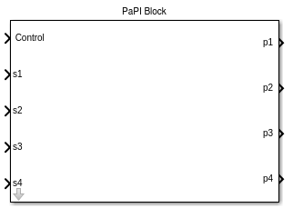
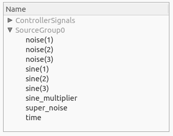
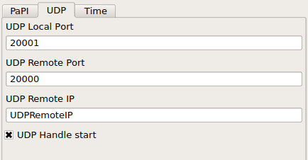

Matlab
======

Dependencies
------------
The PaPI-matlab interface needs the following libraries:

.. list-table:: Libraries
    :widths: 15 30
    :header-rows: 1

    * - Library
      - Description
    * - libjson
      - Better handling of json in cpp
    * - libboost
      - Basic boost library
    * - libboost-thread
      - Boost thread support
    * - libboost-signals
      - Boost signal support

The depencies can be easily fulfilled by installing the following packages:

.. code:: bash

    sudo apt-get install libjsoncpp-dev libboost1.55-dev
    sudo apt-get install libboost-thread1.55-dev libboost-signals1.55-dev

Library
-------

The library is made out of two blocks:

.. |PaPI_Block_img_desc| replace:: The `PaPI Block` is the core block which calls the underlying S_Function to provide a communicaion with PaPI.
                                   This block `SHOULD NOT` be used.

.. |PaPI_Block_Complete_img_desc| replace:: The `PaPI Block Complete` made of sub system which contains the `PaPI Block`.
                                            This blocks contains an easy configurable interface to the core block. This block `SHOULD` be used.

.. |PaPI_Block_Complete_img| image:: _static/matlab/PaPI_Block_Complete.png
                             :height: 250

+---------------------------+----------------------------------+
| |PaPI_Block_img|          | |PaPI_Block_Complete_img|        |
+---------------------------+----------------------------------+
| |PaPI_Block_img_desc|     | |PaPI_Block_Complete_img_desc|   |
+---------------------------+----------------------------------+

Build
-----

All needed functions are compiled and added to the Matlab search path when the build was executed.
The build script can be found in `</path/to/papi>/PaPI/matlab/`

After execution the new library `PaPI` will appear in the simulink library.

Code generation 
---------------

By using the ert_linux it is also possible to build (code generation) a simulink model but it is needed to modify some model settings.

The settings for `Code Generation` must be edited as following:

.. code-block:: matlab

    Make command:

    make_rtw OPTS="-DWITH_HW"

The settings for `Code Generation/Custom Code` must be edited as following:

.. code-block:: matlab

    Include directories:

    /usr/local/MATLAB/R2014b/sys/os/glnxa64/
    /usr/lib/x86_64-linux-gnu/
    /usr/include/

.. code-block:: matlab

    Libraries:

    libstdc++.so.6
    libgcc_s.so.1 
    libgfortran.so.3
    libdl.so
    libboost_system.so
    libboost_thread.so
    libboost_signals.so

Block Configuration
-------------------
Tab 1
^^^^^
.. figure:: _static/matlab/Tab_1.png
   :figwidth: 40%
   :alt:

   **This tab is used to describe the signals and parameters as they appear in PaPI.**

The array [1,2,3,4] given in 'Amount parameters' leads to 4 different parameters, the parameter dimension is defined by the corresponding array index.
Therefore, the first parameter has a size of 1, the second a size of 2, the third a size of 3 and the fourth a size of 4. Is is also possible to name the parameters by setting a signal name in simulink.

The array [1,1,1,1] given in 'Define input signals' leads to 4 different signals, the signal dimension is defined by the corresponding array index. Therefore, all signals have a size of one.
It is also possible to describe if the signal should be splitted, which is the default case. Having a signal of dimension 4 which should be splitted leads to four different signals in PaPI, if not only one signal with the size four appears in PaPI.

The field 'Json config' can be used to provide a configuration which is sent to PaPI. This configuration can be used to control nearly everything in PaPI (create plugins and subscriptions).

Parameters
~~~~~~~~~~

.. |Paremter_Ex_1_cap| replace:: **Signals of the parameters were named in simulink.**

.. |Parameter_Example_2| image:: _static/matlab/Parameter_Example_2.png
                         :alt:
                         :height: 250

.. |Paremter_Ex_2_cap| replace:: **As the parameters will appear in PaPI.**

------------

+-----------------------+------+-----------------------+
| |Parameter_Example_1| |      | |Parameter_Example_2| |
|                       |      |                       |
| |Paremter_Ex_1_cap|   |      | |Paremter_Ex_2_cap|   |
+-----------------------+------+-----------------------+

------------

Signals
~~~~~~~

.. |Signal_Ex_1_cap| replace:: **Signals were named in simulink.**

.. |Signal_Ex_2_cap| replace:: **As the signals will appear in PaPI.**

------------

+-----------------------+------+-----------------------+
| |Signal_Example_1|    |      | |Signal_Example_2|    |
|                       |      |                       |
| |Signal_Ex_1_cap|     |      | |Signal_Ex_2_cap|     |
+-----------------------+------+-----------------------+

------------

Naming
~~~~~~

Tab 2
^^^^^

   **This tab is used set the needed information for the udp communication.**

Tab 3
^^^^^
.. figure:: _static/matlab/Tab_3.png
   :figwidth: 40%
   :alt:

   **This tab provides the ability to set a sampling rate for the underlying blocks.**

Example: Stateflow
------------------

For stateflow it is neccessary to create a simulink function which contains the simulink blocks.

The following picture was taken from the example `simulink_example_stateflow` which can be found in `data_sources/Simulink`.

The second input was mapped to the input `control` of the underlying PaPI Block.
At entry the control input is set to one for starting the internal UDPServer of the current PaPI Block. The UDPServer is stopped by setting the control input to two.
This must be done when different PaPI Blocks if not a single block is gonna occupy the used udp port forever .

   **Exemplary use in a state.**
