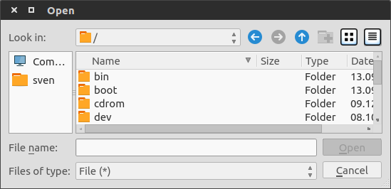
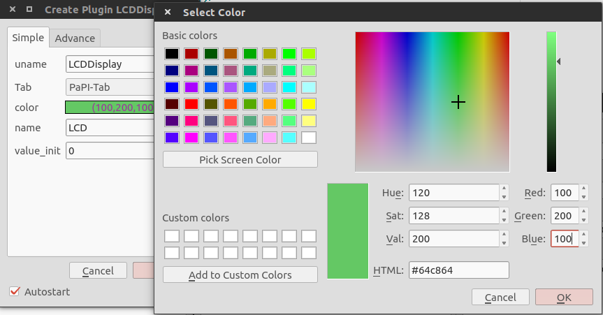

.. _man_design_guide:

Design Guide Plugin development
===============================

How to ...
----------

start
~~~~~

The plugins are written in python 3.4. For the development we recommend to use one of these tools:

   - Any editor with syntax highlighting (e.g. `gedit <https://wiki.gnome.org/Apps/Gedit>`_, `atom <https://github.com/atom/atom>`_)
   - `PyCharm <https://www.jetbrains.com/pycharm/>`_

The name of a plugin has to be unique, in the following we will use ``<unique-plugin-name>`` as a placeholder.

The plugin directory ``<unique-plugin-name>`` has to contain a plugin python file ``<unique-plugin-name>.py``, a plugin description file ``<unique-plugin-name>.yapsy-plugin``. Additionally it is possible and recommended to add a documentation as a plugin documentation file ``<unique-plugin-name>.rst`` and a small icon as 16x16 png with the name ``box.png``. Files, which are used in the rst-file, should be stored in the sub folder ``_static``, otherwise these files wont be recognized during the documentation build process.

A sample folder structure is given here:

.. code-block:: None

    /LCDDisplay/
        _static/
            LCDDisplay.png
        LCDDisplay.py
        LCDDisplay.rst
        LCDDisplay.yapsy-plugin
        box.png

The plugin must be categorized by storing the plugin directory in one of the sub folders, which can be found here: ``papi/plugin/``

It is recommended to use a given template for the **plugin python file**, which enables an ease entry point for the
development of an own plugin. The template files can be found in
``papi/plugin/templates``.

-  ``IOP_DPP_template.py`` - template for the development of IO-Plugins
   or Data Processing Plugin.
-  ``visual_template.py`` - template for the development of visual
   Plugins.

The **plugin description** file has to provide the following information as an ini file and must be stored as ``<unique-plugin-name>.yapsy-plugin``.

.. code-block:: ini

    [Core]
    Name = <unique-plugin-name>
    Module = <unique-plugin-name>

    [Documentation]
    Author = Foo Bar
    Version = 1.0
    Description = This FooBar plugin is used by PaPI.
    Icon = License: <URL>, Provided by: <URL>

By using `rst <http://docutils.sourceforge.net/rst.html>`_ for the documentation, the **plugin documentation** file ``<unique-plugin-name>.rst`` will be recognized during the documentation build process  .

create blocks
~~~~~~~~~~~~~

Blocks are used to collect all signals created by the same source. An
entire block and or a single signal can be subscribed by other plugins
e.g. a plot. We recommend to read :ref:`Signals/Blocks <man_signal_block>`.

It is necessary to imports this objects:

.. code-block:: python

    from papi.data.DPlugin import DBlock
    from papi.data.DSignal import DSignal

In the following we gonna create a Block with the name ``Source``. In
the next step a signal named ``Step`` is created and added to the
previous created Block. At the end the PaPI-backend will be informed and
the Block can be used by other plugins. It is **very important** to know
that the PaPI-backend only knows the last blocks sent by
``send_new_block_list``. Previous sent blocks will be deleted.

.. code-block:: python
    :linenos:

    def cb_initialize_plugin(self):

       self.block = DBlock('Source')
       signal = DSignal('Step')
       self.block.add_signal(signal)
       self.pl_send_new_block_list([block])

send new data
~~~~~~~~~~~~~

Here we assume an IOPlugin which ``cb_execute`` function is called in a loop. In the first step the plugin must be initialized.

.. code-block:: python
    :linenos:

    def cb_initialize_plugin(self):

        self.block = DBlock('Source')
        self.step_signal = DSignal('Step')
        self.block.add_signal(self.step_signal)
        self.pl_send_new_block_list([self.block])

        self.delta_t = 0.1 #[s]
        self.t = 0
        self.signal_value = 0

In the next step we implement the ability to provide a step at time 10.

.. warning:: This is just an easy example. PaPI doesn't provide soft real-time.

.. code-block:: python
    :linenos:

    def cb_execute(self, Data=None, block_name = None, plugin_uname = None):

        if self.t < 10:
            self.signal_value = 1

        self.pl_send_new_data('Source', [self.t], {'Step' : vec[self.signal_value]} )

        self.t += self.delta_t
        time.sleep(self.delta_t)

An alternative call of ``pl_send_new_data`` is given here:

.. code-block:: python

        self.pl_send_new_data(self.block.get_name(), [self.t], {self.step_signal.get_name() : vec[self.signal_value]} )

create parameters
~~~~~~~~~~~~~~~~~

Parameters are used to enable an external control of a running plugin. We recommend to read :ref:`Parameters <man_parameters>`.

It is necessary to imports this object:

.. code-block:: python

    from papi.data.DParameter import DParameter

At first three parameters are created and the PaPI-backend gets
informed. To limit possible user entries in the frontend, a regex
was defined for the

.. code-block:: python
    :linenos:

    def cb_initialize_plugin(self):

        self.para_foo      = DParameter('foo',default=0)
        self.para_bar      = DParameter('bar',default=0)
        self.para_baz      = DParameter('baz',default=1, Regex='[0-9]+')

        self.pl_send_new_parameter_list(para_list)

create events
~~~~~~~~~~~~~

Events are used to change parameters of other plugins. We recommend to read :ref:`Events <man_events>`.

It is necessary to imports this object:

.. code-block:: python

    from papi.data.DSignal import DEvent

A new event is defined by the following code and at the end the PaPI-backend will be informed and
the event can be used to change parameters of other plugins. It is **very important** to know
that the PaPI-backend only knows the last events sent by
``send_new_event_list``. Previous sent events will be deleted. In the code above a button also created which is used to trigger the change event by user interaction (clicking the button).

.. code-block:: python
    :linenos:

    def cb_initialize_plugin(self):

        self.event_start         = DEvent('Start')
        self.pl_send_new_event_list([self.event_start])

        self.button = QPushButton(self.name)
        self.button.clicked.connect(self.clicked_start_button)
        self.button.setText('Click')

    The event can be emitted as following, here as the result of clicking a button in the GUI.

.. code-block:: python
    :linenos:

    def clicked_start_button(self):
        self.pl_emit_event('1', self.event_start)

create a configuration
~~~~~~~~~~~~~~~~~~~~~~

It is possible to set a default configuration for every plugin which can
be modified by the user during the creation process.

The callback function `cb_get_plugin_configuration` is used to inform the PaPI backend about the configuration.

.. code-block:: python
    :linenos:

    def cb_get_plugin_configuration(self):
        config = {
            'flag': {
                'value': "0",
                'regex': '^(1|0)$',
                'type': 'bool',
                'display_text': 'Flag',
                'tooltip' : 'Checkable checkbox'
          },
            'color': {
                'value': "(123,123,123)",
                'regex': '^\(\d+\s*,\s*\d+\s*,\s*\d+\)$',
                'type': 'color',
                'advanced': '1',
                'display_text': 'Color'
            },
            'file': {
                'value': "",
                'advanced': '1',
                'type' : 'file',
                'display_text': 'Needed File',
                'tooltip' : 'File needed by the plugin'
            },
            'text': {
                'value': 'Wert',
                'advanced': '1',
                'display_text': 'Erweiterter Wert'
            }
        }
        return config

As you can see it is possible to describe a single configuration attribute in a detailed way but only the key ``value`` is mandatory.

The other keys are used to provided a comfortable change of the attribute during the creation process. The following table provides an overview over all supported keys for describing an arbitrary attribute.

.. list-table:: Possible key for describing an attribute
    :widths: 3 10
    :header-rows: 1

    * - Key
      - Description
    * - value
      - Mandatory key !!
    * - regex
      - used to limit the possible user entries in a textfield by the use of a regular expression.
    * - type
      - enables additional gui elements in the creation dialog.
    * - advanced
      - is used display this attribute on an additional tab in the creation dialog.
    * - display_text
      - sets the name of the attribute as it is seen by the user.
    * - tooltip
      - used to define a tooltip triggered by a mouse hover.

PaPI supports currently only the following types.

.. list-table:: Supported types
    :widths: 3 10 3
    :header-rows: 1

    * - Type
      - Description
      - Value
    * - color
      - Opens a color picker
      - (r,g,b)
    * - file
      - Opens a file dialog
      - ~/config/File.xml
    * - bool
      - Checkbox
      - (0|1)

In case of an unknown type or none type was defined a simple textfield is used.

+--------------------+--------------------+
|   |FILEDIALOG|     | |COLORPICKER|      |
|                    |                    |
| **File dialog.**   | **Color picker.**  |
+--------------------+--------------------+

get a configuration at startup
~~~~~~~~~~~~~~~~~~~~~~~~~~~~~~

The plugin configuration can be changed by the user during the creation process of the plugin and leads to a modified configuration which will be used as startup configuration. This configuration can be accessed in three different ways:

1. Use of ``pl_get_config_element``: This function provides the value of an provided attribute, is also possible define another key whose value should be returned.

.. note:: We recommend to use this function.

.. code-block:: python
    :linenos:

    def cb_initialize_plugin(self):
        self.color       = self.pl_get_config_element('color')
        self.color_regex = self.pl_get_config_element('color','regex')

2. Use of ``pl_get_current_config``: This function provides a copy of the complete modified configuration. The plugin developer has to check if the attribute, e.g. color, exists in the configuration. Otherwise an exception can be raised due to an missing key name in the configuration.

.. code-block:: python
    :linenos:

    def cb_initialize_plugin(self):
        self.config      = self.pl_get_current_config()
        self.color       = self.config['color']['value']
        self.color_regex = self.config['color']['regex']

3. Use of ``pl_get_current_config_ref``: This function provides a reference to the complete modified configuration. Single values are accessed in the same way as in the example before but changes in the configuration will affected the startup configuration. Thereby it is possible to modify the configuration for the next startup if the current PaPI setting is saved as an XML file because the current startup configuration will be stored and taken when the configuration is loaded.

.. warning:: Use this function only if you know what you do ! Take a look at the documentation for this function.

.. code-block:: python
    :linenos:

    def cb_initialize_plugin(self):
        self.config      = self.pl_get_current_config()
        self.color       = self.config['color']['value']
        self.color_regex = self.config['color']['regex']

        self.config['text']['value'] = 'FooBar'

If you only like to change one single value in the startup configuration we recommend the function ``pl_set_config_element``:

.. warning:: Use this function only if you know what you do !  Take a look at the documentation for this function.

.. code-block:: python
    :linenos:

    def cb_initailize_plugin():
        pl_set_config_element('color', '(10,20,30)')

What happens if PaPI ...
------------------------

sends new data?
~~~~~~~~~~~~~~~

The function ``cb_execute`` is called by the PaPI backend with a currently
received data set. Data is a dictionary with an entry ``CORE_TIME_SIGNAL``, a constant defined in `papi.constants.`, which contains
the time vector. The other entries are data vectors of subscribed signals. To determine the
data source the corresponding block\_name  and plugin\_name is given for a single cb_execute
step.

.. code-block:: python
    :linenos:

    import papi.constants as pc

    def cb_execute(self, Data=None, block_name = None, plugin_uname = None):
       time = Data[pc.CORE_TIME_SIGNAL]

       for signal_name in Data:
          if signal_name != pc.CORE_TIME_SIGNAL:
             data = Data[signal_name]

sends a parameter changes?
~~~~~~~~~~~~~~~~~~~~~~~~~~

The ``set_parameter`` is always called when a parameter is changed. To
determine the modified parameter the parameter's name is given as
``name``, of course the new value is also given as ``value``. The value
is always from type ``string`` that means it may be necessary to cast
the string as float, or int.

.. code-block:: python
    :linenos:

    def cb_set_parameter(self, name, value):
        if name == 'ParameterName1':
            print(name + " --> " + str(value));

        if name == 'ParameterName2':
            new_int = int(float(value))
            print(name + " --> " + str(new_int))

        if name == 'ParameterName3':
            if int(float(value)) == int('1'):
                print(name + " --> " + " True ")
            else:
                print(name + " --> " + " False ")

What happens if the user triggers ...
-------------------------------------

pause?
~~~~~~

The PaPI framework executes this functions

.. code-block:: python

    def pause(self):
        """
        Function pause

        :return:
        """
        pass

This enables the developer to handle a users wish to break the plugin. PaPI will also stop to call the ``cb_execute(Data, block_name, plugin_uname)`` function.

resume?
~~~~~~~

The PaPI framework executes this functions

.. code-block:: python

    def resume(self):
        """
        Function resume

        :return:
        """
        pass

This enables the developer to handle a users wish to resume the plugin. PaPI will start again to call the ``cb_execute(Data, block_name, plugin_uname)`` function if necessary.

quit?
~~~~~

The PaPI framework executes this functions

.. code-block:: python

    def quit(self):
        """
        Function quit

        :return:
        """
        pass

When this function was exectuted PaPI will stop and remove the plugin.
