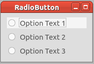

Radiobutton
===============

.. topic:: General description

    The Radiobutton plugin is used to provided a choice of different options.

Configuration
----------------------
The plugin uses this specific configuration.

.. list-table:: Plugin configuration
    :widths: 15 10 30
    :header-rows: 1

    * - Name
      - Type
      - Description
    * - option_texts
      - CSV
      - String used to name the different options.
    * - option_values
      - CSV
      - Value which is sent instead of the chosen option_text.
    * - selected_index
      - Int
      - Used to preselect an index.

Parameter
----------------------
A plugin instance can be manipulated by the following parameter.

.. list-table:: Provided parameter
    :widths: 15 10 30
    :header-rows: 1

    * - Name
      - Possible value
      - Description
    * - Texts
      - CSV
      - String used to name the different options.
    * - values
      - CSV
      - Value which is sent instead of the chosen option_text.

Events
----------------------
A plugin instance provides this events which can be used to manipulated parameters of other plugins.

.. list-table:: Provided events
    :widths: 15 10 30
    :header-rows: 1

    * - Name
      - Type
      - Description
    * - Choice
      - \-
      - Sent when choice has changed.
