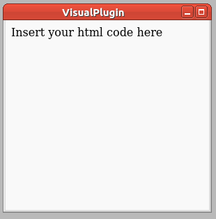

HTMLViewer
==========

.. topic:: General description

    This plugin is used to display html.

Dependencies
-----------

.. code:: bash

    sudo apt-get install python3-pyqt5.qtwebkit

Configuration
-------------
The plugin uses this specific configuration.

.. list-table:: Plugin configuration
    :widths: 15 10 30
    :header-rows: 1

    * - Name
      - Type
      - Description
    * - content
      - String
      - Plain html code to be displayed.
    * - isUrl
      - Int
      - Set to 1 if the content is an url that should be loaded.

Parameter
---------
A plugin instance can be manipulated by the following parameter.

.. list-table:: Provided parameter
    :widths: 15 10 30
    :header-rows: 1

    * - Name
      - Type
      - Description
    * - None
      - None
      - None
