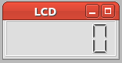

LCDDisplay
===============

.. topic:: General description

    This plugin is used to display a single number.

Configuration
----------------------
The plugin uses this specific configuration.

.. list-table:: Plugin configuration
    :widths: 15 10 30
    :header-rows: 1

    * - Name
      - Type
      - Description
    * - updateFrequency
      - Int
      - Minimal time between updates (in ms)
    * - value_init
      - Float
      - Used as initial value for the LCD-Display
    * - value_scale
      - Float
      - Used to scale displayed value
    * - value_offset
      - Int
      - Used to offset displayed value
    * - digit_count
      - Int
      - Number of digits

Parameter
----------------------
A plugin instance can be manipulated by the following parameter.

.. list-table:: Provided parameter
    :widths: 15 10 30
    :header-rows: 1

    * - Name
      - Type
      - Description
    * - update_interval
      - Int
      - Minimal time between updates (in ms)
    * - value_scale
      - Float
      - Used to scale displayed value
    * - value_offset
      - Int
      - Used to offset displayed value
    * - digit_count
      - Int
      - Number of digits