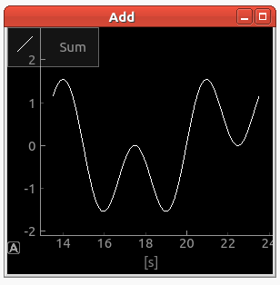

Plot
===============

.. topic:: General description

    This plugin is used to signals over a time axis.

Configuration
----------------------
The plugin uses this specific configuration.

.. list-table:: Plugin configuration
    :widths: 15 10 10 30
    :header-rows: 1

    * - Name
      - Type
      - Example
      - Description
    * - x-grid
      - Bool
      - (1|0)
      - Enables X-Grid
    * - y-grid
      - Bool
      - (1|0)
      - Enables Y-Grid
    * - color
      - String
      - [0 1 2 3 4]
      - Used to set a color for the specific i-th signal.
    * - style
      - String
      - [0 1 2 3 4]
      - Used to set a style for the specific i-th signal.
    * - buffersize
      - Bool
      - 100
      - Defines the buffersize.
    * - downsampling_rate
      - Int
      - (1|20|100)
      - Used to set an internal downsampling.
    * - rolling_plot
      - Bool
      - (1|0)
      - Start the plot as rolling plot.
    * - yRange
      - Array
      - [-3.0 1.0]
      - Sets the y range of the plot.

Parameter
----------------------
A plugin instance can be manipulated by the following parameter.

.. list-table:: Provided parameter
    :widths: 15 10 10 30
    :header-rows: 1

    * - Name
      - Type
      - Example
      - Description
    * - x-grid
      - Bool
      - (1|0)
      - Enables X-Grid
    * - y-grid
      - Bool
      - (1|0)
      - Enables Y-Grid
    * - color
      - String
      - [0 1 2 3 4]
      - Used to set a color for the specific i-th signal.
    * - style
      - String
      - [0 1 2 3 4]
      - Used to set a style for the specific i-th signal.
    * - buffersize
      - Bool
      - 100
      - Defines the buffersize.
    * - downsampling_rate
      - Int
      - (1|20|100)
      - Used to set an internal downsampling.
    * - rolling
      - Bool
      - (1|0)
      - Start the plot as rolling plot.
    * - yRange
      - Array
      - [-3.0 1.0]
      - Sets the y range of the plot.