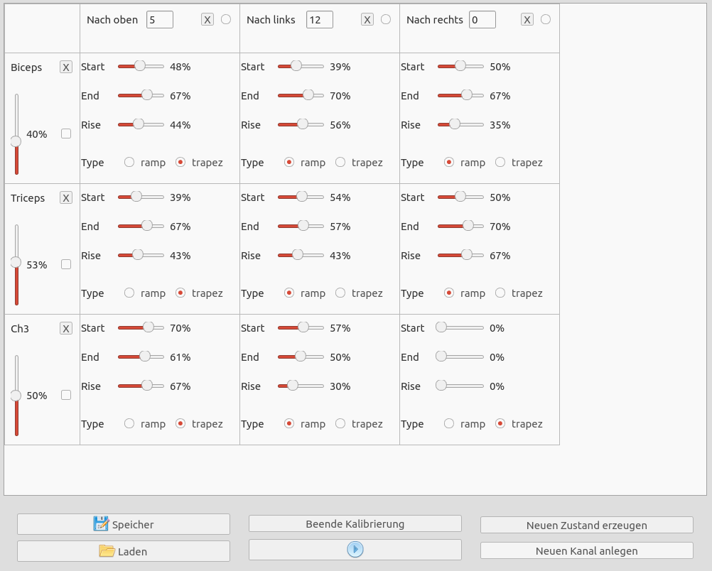

RehaStimGUI
===========

.. topic:: General description

    This plugin is used to create stimulation profile for different channels. It is possible to create different states.

Configuration
-------------
The plugin uses this specific configuration.

.. list-table:: Plugin configuration
    :widths: 15 10 50
    :header-rows: 1

    * - Name
      - Type
      - Description
    * - config
      - String
      - Configuration which should be loaded if the file exists.
    * - maximized
      - Bool
      - General attribute whose default value was set to 1.
    * - signal_next_state
      - String
      - Signal which contains the next state which should be chosen in the gui.
    * - readonly
      - Bool
      - Removes the ability to add/remove channels/states when enabled

Parameter
---------
A plugin instance can be manipulated by the following parameter.

.. list-table:: Provided parameter
    :widths: 15 10 10 50
    :header-rows: 1

    * - Name
      - Type
      - Example
      - Description
    * - None
      - None
      - None
      - None

Events
------
A plugin instance provides this events which can be used to manipulated parameters of other plugins.

.. list-table:: Provided events
    :widths: 15 10 30
    :header-rows: 1

    * - Name
      - Type
      - Description
    * - StimulatorConfiguration
      - Array[float]
      - Sent when a state was changed
    * - Heartbeat
      - Int
      - Value is changed every second.
    * - MaximaSlider
      - Array[float]
      - Sent when a channel slider was changed.
    * - ControlStim
      - Int
      - General control signal.
    * - NextState
      - Int
      - Sent when the user wants to change the state.
    * - Start
      - Int
      - Sent when 'start' or 'stop' was pressed.

The **StimulatorConfiguration** event has following structure:

.. code::

    [state_nr_1, is_next, ch_1_start, ch_1_end, ch_1_rise, ch_1_type, ch_2_start, ... , state_nr_2, is_next, ch_1_start, ... ]

The **Heartbeat** event is used to inform the backend that the GUI is still alive. The heartbeat changes it's value between 1 and 2 every second.

The **MaximalSlider** event has following structure:

.. code::

    [slider_value_1, slider_active_1, slider_value_2, slider_active_2, ... ]

The slider_value is given in the range [0,1] with a resolution of 101, the current slider state is described by 1 (active) and 0 (inactive).

The **ControlStim** event is used to trigger different actions, currently we use 2 to trigger the calibration process and 3 to finish the calibration process.

The **Start** event is used to trigger start by 1 and stop by 0.

The **NextState** event is used to send the preferred next state.

Example
-------

A default configuration for this plugin can be found here: :download:`example_config.xml <_static/example_config.xml>`

A simulink model and with a PaPI configuration can be found here: :download:`SimulinkModel <_static/rehastim_gui.slx>`, :download:`PaPI Configuration <_static/rehastim_config.m>`,

It is only necessary to build the model, start the binary, start PaPI and start the :doc:`man.papi.plugin.visual.PaPIController.PaPIController`.
